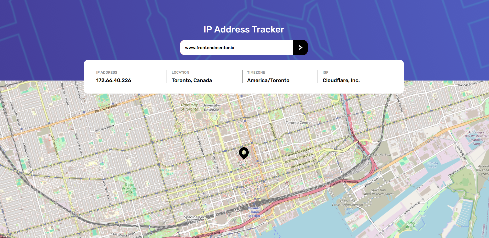

# Frontend Mentor - IP address tracker solution

This is a solution to the [IP address tracker challenge on Frontend Mentor](https://www.frontendmentor.io/challenges/ip-address-tracker-I8-0yYAH0). Frontend Mentor challenges help you improve your coding skills by building realistic projects. 

## Table of contents

- [Overview](#overview)
  - [The challenge](#the-challenge)
  - [Screenshot](#screenshot)
  - [Links](#links)
- [My process](#my-process)
  - [Built with](#built-with)
- [License](#license)
- [Author](#author)

## Overview

### The challenge 🎯 

Users should be able to:

- View the optimal layout for each page depending on their device's screen size
- See hover states for all interactive elements on the page
- See their own IP address on the map on the initial page load
- Search for any IP addresses or domains and see the key information and location

### Screenshot

### Links

- Solutions URL: [frontendmentor-IP-Address-Tracker](https://www.frontendmentor.io/challenges/ip-address-tracker-I8-0yYAH0/hub)
- Live Site URL: [IP-Address-Tracker](https://hadi-sanei.github.io/IP-Address-Tracker)

## My process

### Built with

- 
- 
- 
- 
- 

## License

Distributed under the MIT License. See `LICENSE` for more information.

## Author

- Github - [Hadi Sanei](https://github.com/hadi-sanei)
- Frontend Mentor - [@hadi-sanei](https://www.frontendmentor.io/profile/hadi-sanei)

(<a href="#ip-address-tracker">back to top</a>)
